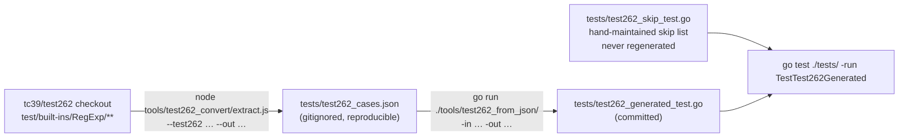

# Contributing to goecma262

Thanks for contributing! This guide covers the development workflow, the
Test262 test pipeline, and how to maintain the known-failure skip list.
For how the engine works internally, see [docs/architecture.md](docs/architecture.md).

## Development setup

Go 1.23+ is all you need to build and test. Node.js (any recent version, no
`npm install` required) is needed only if you regenerate the Test262 suite.

```bash
go build ./...
go test ./...                              # unit tests, examples, and 66k+ Test262 cases
go test ./tests/ -bench . -benchmem       # benchmarks
```

Documentation-bearing code snippets live in `example_test.go` as godoc
`Example` functions with `// Output:` assertions — if you change behavior a
snippet relies on, `go test` fails. Prefer adding an example there over
pasting unverified snippets into the README.

## Areas that need work

- Emoji-family Unicode properties (`\p{Emoji}`, `\p{Extended_Pictographic}`, …)
  — need embedded Unicode data; currently rejected at compile time
- Performance optimizations

## The Test262 pipeline

The implementation is tested against the official ECMAScript
[Test262](https://github.com/tc39/test262) suite. Test cases are extracted
from the `test/built-ins/RegExp` subtree and compiled into a committed Go
test file, so `go test` works without Node or a Test262 checkout:



To regenerate after updating the Test262 checkout or extending the extractor:

```bash
# 1. Extract cases from the Test262 source tree (Node built-ins only)
node tools/test262_convert/extract.js \
    --test262 /path/to/test262 \
    --out tests/test262_cases.json

# 2. Generate the Go test file
go run ./tools/test262_from_json/ \
    -in  tests/test262_cases.json \
    -out tests/test262_generated_test.go
```

This is the only supported pipeline; earlier generator tools that wrote a
different case-table schema have been removed.

## The known-failure skip list

`tests/test262_skip_test.go` is the **canonical record** of which Test262
cases cannot pass in a static Go API and why — each entry carries a comment
explaining the reason. The file is hand-maintained and never touched by the
generator, so it survives regeneration. When the README quotes skip counts,
those numbers derive from this file.

If a regeneration surfaces a new case that cannot pass in Go, add it there:

```go
var test262KnownFailures = map[string]string{
    // existing entries ...
    "new-test-name.js#42": "reason this cannot be implemented in Go",
}
```

The map key is the `tc.name` value printed by `go test -v`. The value is a
human-readable explanation shown in the skip message. Only add an entry when
the semantics genuinely cannot be expressed in Go (e.g. the test needs a JS
function as a replacement argument) — a failing case that *could* pass is a
bug to fix, not a skip to add.

### Strict mode

By default, compile and flag-parse errors in generated cases produce
`t.Skip`, so an experimental parser change doesn't drown you in failures.
Set `TEST262_STRICT=1` to promote those skips to `t.Fatal`, which catches
regressions where a previously compiling pattern stops compiling:

```bash
TEST262_STRICT=1 go test ./tests/ -run TestTest262Generated
```

## Refreshing the README benchmark numbers

The README quotes `go test ./tests/ -bench . -benchmem` output. If your
change affects performance, re-run that command and update the numbers (and
the CPU model if it differs) in the same PR, so the quoted figures stay
reproducible.
