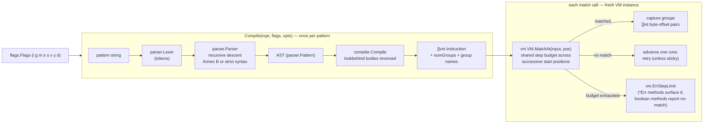
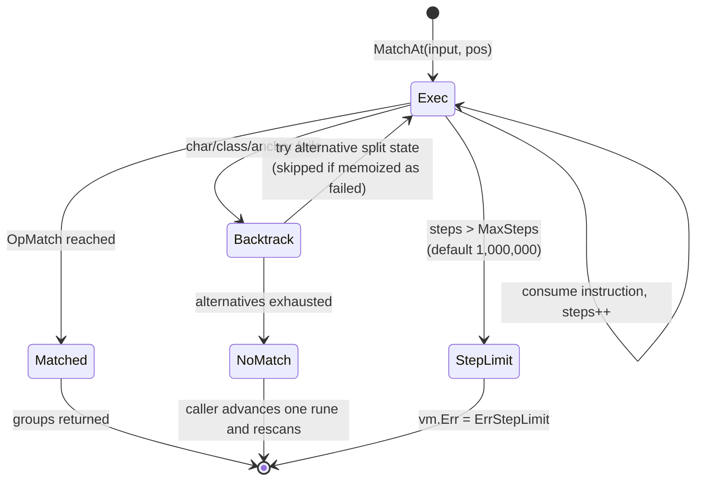

# Architecture

How goecma262 turns an ECMA-262 pattern into match results. Read this if you
are changing the parser, compiler, or VM, or debugging why a pattern behaves
the way it does. For the user-facing API, see the
[package documentation](https://pkg.go.dev/github.com/mgilbir/goecma262);
for the test pipeline, see [CONTRIBUTING.md](../CONTRIBUTING.md).

## Why a backtracking engine

Go's standard `regexp` is RE2-based: linear-time, but structurally unable to
support backreferences and unbounded lookarounds. ECMA-262 requires both, so
this library uses a backtracking virtual machine instead — the design
described in Russ Cox's regular-expression articles as the "recursive
backtracking" approach. The classic cost of that choice, exponential blowup
on pathological patterns (ReDoS), is bounded by two mechanisms described
below: a per-search step budget and memoization of failed split states.

## Pipeline

The five packages map onto the pipeline:

| Package | Role | Key entry point |
|---|---|---|
| `parser` | Pattern string → AST. Recursive descent; enforces `MaxNestingDepth`. Handles Annex B leniencies when enabled. | `parser.New(...).Parse()` |
| `compiler` | AST → bytecode. Enforces `MaxQuantifierRepeat` and `MaxProgramSize`. Reverses lookbehind bodies (see below). | `compiler.Compile(ast)` |
| `vm` | Executes bytecode against input. Recursive backtracking with memoization and a step budget. | `vm.VM.MatchAt` |
| `flags` | ECMA-262 flag parsing/printing; rejects duplicates and `u`+`v`. | `flags.Parse` |
| root (`ecma262`) | regexp-package-shaped API; owns the position scan loop, `lastIndex` state, and replacement `$` expansion. | `Compile`, `Regexp` methods |

## Match lifecycle

`Regexp.doMatch` creates a fresh `vm.VM` per operation (this is what makes
non-`g`/`y` instances goroutine-safe) and scans start positions left to
right; the sticky (`y`) flag anchors to exactly one position.

Three details worth knowing before touching the VM:

- **The step budget spans the whole search, not one attempt.** `MatchAt`
  deliberately does not reset the step counter, so scanning every start
  position of a long input shares one `MaxSteps` budget: the ReDoS bound is
  O(MaxSteps) per user-visible operation, not O(len(input)·MaxSteps).
  Callers must check `vm.Err` to distinguish "no match" from "budget hit".
- **Failed split states are memoized.** `visitedSplits` records
  (position, pc, groups) states that already failed, so revisiting the same
  state — the shape of classic catastrophic patterns like `(a+)+$` — fails
  fast instead of re-exploring the subtree. Group contents are part of the
  key because backreferences make them part of the match state.
- **Iteration helpers share one cursor implementation.** `findAllMatches`
  in the root package is the single source of truth for how `FindAll*`,
  `ReplaceAll*`, and `Split` advance past matches (including the
  zero-width-match rune-step rule), so their behaviors cannot drift apart.

## Lookarounds and right-to-left lookbehind

Lookarounds run as sub-VMs over the same input, seeded with the outer match's
capture groups so backreferences inside the assertion resolve correctly
(`vm.matchWithInitialGroups`).

ECMA-262 specifies that lookbehind bodies match **right-to-left**, which is
observable through capture groups: in `(?<=(\w)+)x` the group must hold the
*leftmost* iteration's value. The compiler therefore emits each lookbehind
body structurally reversed (`compiler.reverseExpr`), and the VM runs that
reversed program backward from the current position — a reversed program
matched right-to-left reproduces the spec's capture semantics without a
second evaluation strategy in the VM.

## Case folding and Unicode properties

Case-insensitive matching uses Unicode simple case folding under `u`/`v`,
and the legacy Canonicalize algorithm (`vm.canonicalizeLegacy`,
uppercase-based, with the "don't map non-ASCII to ASCII" guard) otherwise —
matching JavaScript in both modes. `\p{...}` lookups resolve general
categories, `Script=`/`Script_Extensions=`, and binary properties against
Go's `unicode` tables, cached in a `sync.Map` keyed by property expression;
unknown property names are compile errors ("invalid unicode property
escape") rather than silently-empty classes.

## Compile-time and run-time limits

| Limit | Value | Where enforced | Error |
|---|---|---|---|
| Nesting depth | 200 | `parser.MaxNestingDepth`, `compiler.MaxNestingDepth` | "pattern too deeply nested" |
| Single quantifier bound | 10,000 | `compiler.MaxQuantifierRepeat` | "quantifier minimum/maximum … exceeds limit" |
| Compiled program size | 200,000 instructions | `compiler.MaxProgramSize` | "compiled program too large" |
| Execution steps | 1,000,000 (default; `SetMaxSteps`) | `vm.DefaultMaxSteps` | `vm.ErrStepLimit` |

The first three exist because nested quantifiers multiply: `(a{1000}){1000}`
is a million instructions from a 16-byte pattern. The step budget catches
what static limits cannot — input-dependent backtracking cost.
