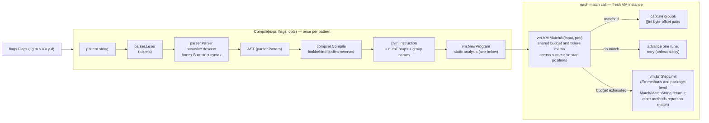
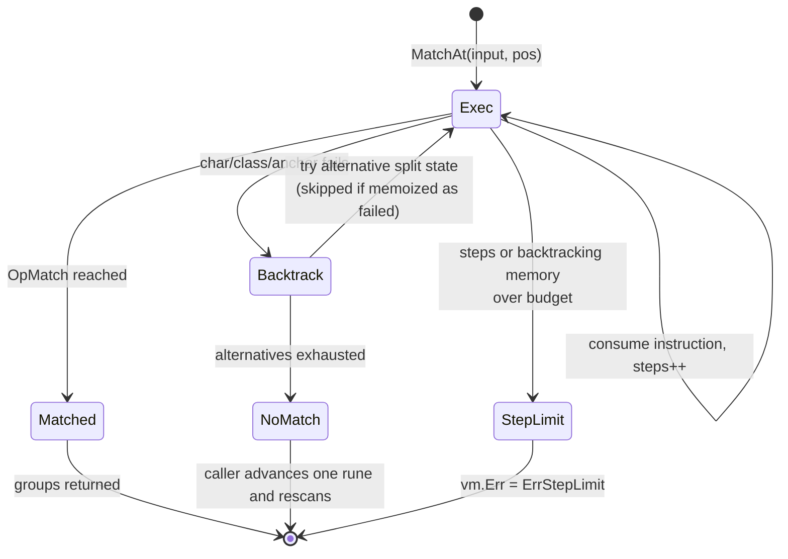

# Architecture

How goecma262 turns an ECMA-262 pattern into match results. Read this if you
are changing the parser, compiler, or VM, or debugging why a pattern behaves
the way it does. For the user-facing API, see the
[package documentation](https://pkg.go.dev/github.com/mgilbir/goecma262);
for the test pipeline, see [CONTRIBUTING.md](../CONTRIBUTING.md).

## Why a backtracking engine

Go's standard `regexp` is RE2-based: linear-time, but structurally unable to
support backreferences and unbounded lookarounds. ECMA-262 requires both, so
this library uses a backtracking virtual machine instead — the design
described in Russ Cox's regular-expression articles as the "backtracking"
approach, run on an explicit heap-allocated stack rather than by recursion, so
no input can overflow the goroutine stack. The classic cost of backtracking,
exponential blowup on pathological patterns (ReDoS), is bounded by the
mechanisms described below: a per-search budget of steps and memory that
grows linearly with the input, memoization of failed split states, and a
static analysis that keeps common patterns linear-time.

## Pipeline

```mermaid
flowchart LR
    subgraph Compile["Compile(expr, flags, opts) — once per pattern"]
        SRC["pattern string"] --> LEX["parser.Lexer<br/>(tokens)"]
        LEX --> PARSE["parser.Parser<br/>recursive descent<br/>Annex B or strict syntax"]
        PARSE --> AST["AST (parser.Pattern)"]
        AST --> COMP["compiler.Compile<br/>lookbehind bodies reversed"]
        COMP --> CODE["[]vm.Instruction<br/>+ numGroups + group names"]
        CODE --> PROG["vm.NewProgram<br/>static analysis (see below)"]
    end
    subgraph Match["each match call — fresh VM instance"]
        PROG --> VM["vm.VM.MatchAt(input, pos)<br/>shared budget and failure memo<br/>across successive start positions"]
        VM -->|"matched"| GROUPS["capture groups<br/>[]int byte-offset pairs"]
        VM -->|"no match"| NEXT["advance one rune,<br/>retry (unless sticky)"]
        VM -->|"budget exhausted"| ERR["vm.ErrStepLimit<br/>(Err methods and package-level<br/>Match/MatchString return it;<br/>other methods report no match)"]
    end
    FLAGS["flags.Flags (i g m s u v y d)"] --> Compile
```

The five packages map onto the pipeline:

| Package | Role | Key entry point |
|---|---|---|
| `parser` | Pattern string → AST. Recursive descent; enforces `MaxNestingDepth`. Handles Annex B leniencies when enabled. | `parser.New(...).Parse()` |
| `compiler` | AST → bytecode. Enforces `MaxQuantifierRepeat` and `MaxProgramSize`. Reverses lookbehind bodies (see below). | `compiler.Compile(ast)` |
| `vm` | Analyses bytecode once (`vm.NewProgram`), then executes it against input: backtracking on an explicit stack, with memoization and a step and memory budget. | `vm.VM.MatchAt` |
| `flags` | ECMA-262 flag parsing/printing; rejects duplicates and `u`+`v`. | `flags.Parse` |
| root (`ecma262`) | regexp-package-shaped API; owns the position scan loop, `lastIndex` state, and replacement `$` expansion. | `Compile`, `Regexp` methods |

## Match lifecycle

`Regexp.doMatch` creates a fresh `vm.VM` per operation (this is what makes
non-`g`/`y` instances goroutine-safe) and scans start positions left to
right; the sticky (`y`) flag anchors to exactly one position.

```mermaid
stateDiagram-v2
    [*] --> Exec: MatchAt(input, pos)
    Exec --> Exec: consume instruction, steps++
    Exec --> Backtrack: char/class/anchor fails
    Backtrack --> Exec: try alternative split state<br/>(skipped if memoized as failed)
    Backtrack --> NoMatch: alternatives exhausted
    Exec --> Matched: OpMatch reached
    Exec --> StepLimit: steps or backtracking memory<br/>over budget
    Matched --> [*]: groups returned
    NoMatch --> [*]: caller advances one rune and rescans
    StepLimit --> [*]: vm.Err = ErrStepLimit
```

Details worth knowing before touching the VM:

- **The budget spans the whole search, not one attempt.** `MatchAt`
  deliberately does not reset the step counter, so scanning every start
  position of a long input shares one budget, and lookaround bodies charge
  the same counter: the ReDoS bound is one budget per user-visible operation,
  not one per start position or per lookaround. Callers must check `vm.Err`
  to distinguish "no match" from "budget hit".
- **The budget grows linearly with the input.** By default a search may take
  `DefaultMaxSteps + DefaultStepsPerByte·len(input)` steps and hold
  `DefaultMaxMemory + DefaultMemoryPerByte·len(input)` bytes of backtracking
  state; `MaxSteps`/`MaxMemory` (`SetMaxSteps`) replace these with fixed
  limits. A fixed default would make every linear-time pattern fail on a
  long enough input — `^[a-z]+$` used to reject a valid 600,000-character
  string — whereas a linear budget still stops every super-linear search.
- **Failed split states are memoized.** The failure memo records visited
  split states, so revisiting one — the shape of classic catastrophic
  patterns like `(a+)+$` — takes the split's exit instead of re-exploring
  branch A. See "Bounded execution" below for how states are keyed.
- **Iteration helpers share one cursor implementation.** `findAllMatches`
  in the root package is the single source of truth for how `FindAll*`,
  `ReplaceAll*`, and `Split` advance past matches (including the
  zero-width-match rune-step rule), so their behaviors cannot drift apart.

## Lookarounds and right-to-left lookbehind

Lookarounds run as nested runs of the same VM over the same input (`vm.run`
with the body's end as its success point), seeded with the outer match's
capture groups so backreferences inside the assertion resolve correctly. They
share the VM's budget and backtrack stack; on return their alternatives are
discarded, which is what makes lookarounds atomic. This recursion is the only
one in matching, and its depth is bounded by the pattern's nesting depth.

ECMA-262 specifies that lookbehind bodies match **right-to-left**, which is
observable through capture groups: in `(?<=(\w)+)x` the group must hold the
*leftmost* iteration's value. The compiler therefore emits each lookbehind
body structurally reversed (`compiler.reverseExpr`), and the VM runs that
reversed program backward from the current position — a reversed program
matched right-to-left reproduces the spec's capture semantics without a
second evaluation strategy in the VM.

## Bounded execution

`vm.run` is a loop over instructions with an explicit backtrack stack of
frames: a *choice* (resume at pc with position), a *trail* entry (restore one
capture slot), or a *greedy loop* frame (see below). A capture write is
trailed only when some choice point could need the old value back — that is,
when the slot has not already been trailed since the innermost choice point
was pushed — so a loop that is never backtracked into holds no stack at all. `backtrack` pops trail entries back to the innermost choice and
resumes there — exactly the depth-first, priority-ordered exploration of a
recursive backtracker, so results are unchanged.

`vm.NewProgram` analyses the bytecode once per `Compile`. Every fact it
records over-approximates what execution could do, and is used only to skip
work whose outcome is already known to be failure, so it changes the cost of
a match, never its result:

- **First-byte sets.** For every split target, the set of bytes that can
  begin (or, right-to-left, end) the next rune consumed on any path from it,
  and whether that path can succeed at the edge of the input — with `$`
  understood as "end of input, or before a line terminator with `m`". A split
  branch whose set excludes the next input byte is neither explored nor
  pushed as an alternative. This is what keeps `^(a)+$` and `^(?:a|b)+$`
  from holding a backtrack entry per character: at every iteration the loop
  exit `$` cannot start, so no alternative is recorded.
- **Greedy single-rune loops.** A split whose branch A consumes one rune and
  jumps back (`x*`, `x+`, `x{n,}` for any single-rune `x`) is executed as a
  scan, and all the exits it may give back are held in one frame that
  retreats one rune per pop. The retreat follows the scan's own rune
  boundaries, including through invalid UTF-8 and from a start inside a
  multi-byte rune. When no rune the loop consumes can begin its exit, the
  loop is possessive and keeps no frame at all.
- **Memo keying.** The failure memo keys a state by (pc, position) when the
  program has neither backreferences nor an empty-matching loop. Then a
  state's outcome is independent of the captures and a revisited state is
  always one that already failed, so the memo is pure pruning; it is kept in
  paged bitsets (one bit per state) and, because a failed state fails from
  any start position, it carries over from one start position to the next —
  which makes unanchored searches such as `[a-z]+$` linear rather than
  quadratic. Otherwise the capture vector is part of the key (interned to a
  small id), and the memo is per attempt: backreferences make outcomes depend
  on captures, and in an empty-matching loop a revisit can be a cycle rather
  than a completed failure, where taking the exit is what terminates it.

`TestOptimisedMatchesReference` (with a fuzz target) checks all of this
differentially: `vm.SetOptimize(false)`, available to tests, disables the
analysis and runs the plain algorithm as the reference.

## Case folding and Unicode properties

Case-insensitive matching uses Unicode simple case folding under `u`/`v`,
and the legacy Canonicalize algorithm (`vm.canonicalizeLegacy`,
uppercase-based, with the "don't map non-ASCII to ASCII" guard) otherwise —
matching JavaScript in both modes. A class, class escape or property escape
matches a character when some case variant of it (a member of its
`unicode.SimpleFold` orbit) is in the set, so under `iu` `\w` also matches
`ſ` and the Kelvin sign (which fold into `[A-Za-z0-9_]`, and which `\b`
therefore treats as word characters) and `\p{Lu}` matches `a`. The one
difference between `u` and `v` there is `\P{...}`: under `u` it matches when
some case variant lacks the property, under `v` when none has it.
`\p{...}` lookups resolve general
categories, `Script=`/`Script_Extensions=`, and binary properties against
Go's `unicode` tables, cached in a `sync.Map` keyed by property expression;
unknown property names are compile errors ("invalid unicode property
escape") rather than silently-empty classes.

## Compile-time and run-time limits

| Limit | Value | Where enforced | Error |
|---|---|---|---|
| Nesting depth | 200 | `parser.MaxNestingDepth`, `compiler.MaxNestingDepth` | "pattern too deeply nested" |
| Single quantifier bound | 10,000 | `compiler.MaxQuantifierRepeat` | "quantifier minimum/maximum … exceeds limit" |
| Compiled program size | 200,000 instructions | `compiler.MaxProgramSize` | "compiled program too large" |
| Execution steps | 1,000,000 + 100 per input byte (default; `SetMaxSteps` sets a fixed limit) | `vm.DefaultMaxSteps`, `vm.DefaultStepsPerByte` | `vm.ErrStepLimit` |
| Backtracking memory | 256 MiB + 32 bytes per input byte (default; `vm.VM.MaxMemory`) | `vm.DefaultMaxMemory`, `vm.DefaultMemoryPerByte` | wraps `vm.ErrStepLimit` |

The first three exist because nested quantifiers multiply: `(a{1000}){1000}`
is a million instructions from a 16-byte pattern. The execution budget
catches what static limits cannot — input-dependent backtracking cost.
