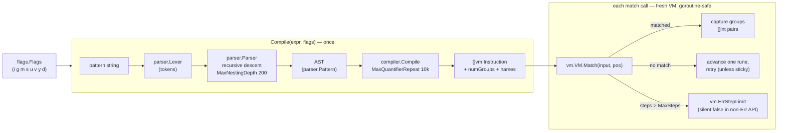
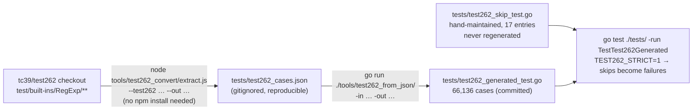
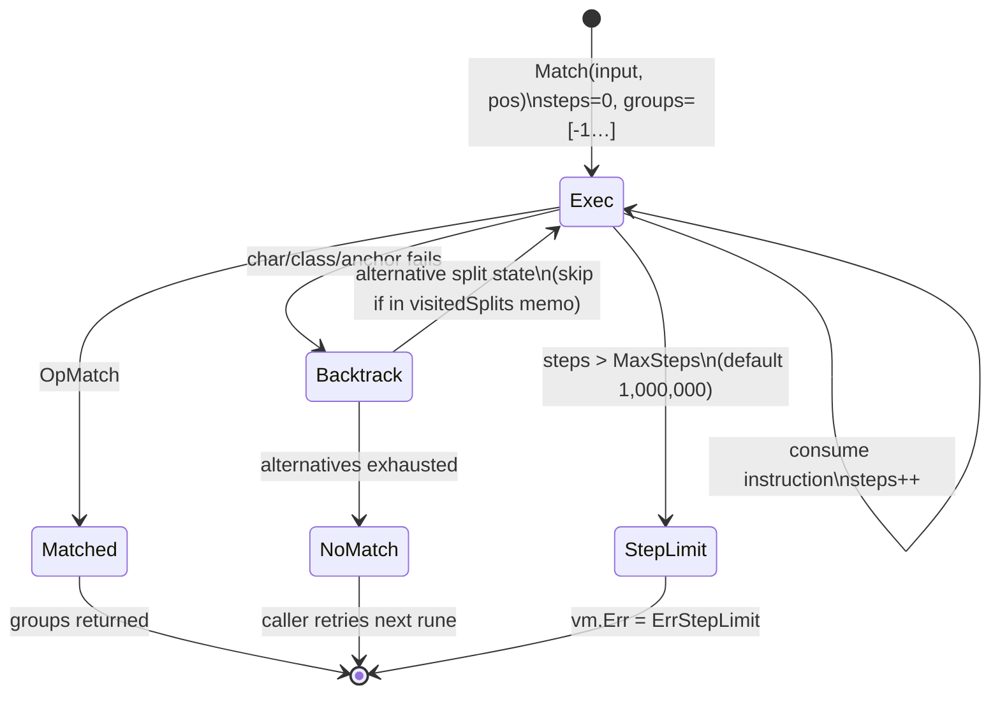

# Docs audit — goecma262 — 2026-07-09

Auditor: Claude (docs-as-artifact audit). Every accuracy claim below was tested against the
code at commit `8bfa4bb` by running it; verdicts are **CONFIRMED** (verified by execution or
direct code inspection) or **PLAUSIBLE** (suspected, not fully verified).

## Status addendum (2026-07-10)

Re-verified against `main` after the audit/01–13 PRs merged. Already resolved by that work:
**D1** (variable-length + RTL lookbehind implemented; README updated), **D4**
(`extractGroupNames` now indexed by group number; `SubexpIndex` finds lookaround groups),
**D5** (`ReplaceAllStringFunc` now honors `g` via shared `findAllMatches`), **D9** (benchmark
numbers refreshed with the command line), and part of **D19** (`UnmarshalText` removed).
The `d`-flag row and Known Limitations were also rewritten (affects D6's neighborhood, but
the `g` row is still wrong).

Still open and addressed by the `docs-audit/*` PR stack: D2, D3, D6, D7, D8, D10, D11, D12,
D13, D14, D15, D16, D17, D18, D20, D21, D22 — plus two regressions the merged work
introduced: the package/type godoc concurrency claim is now false for `g`/`y` instances
(`MatchString`/`FindStringSubmatch` auto-advance `lastIndex`), and `Compile`'s doc comment
was split in half by the inserted `Syntax` type declaration.

**The headline:** the Test262 story — the project's centerpiece claim — is fully accurate
(66,136 cases, exactly 17 skips, every category and count in the README matches a live run).
But the README **understates the library** in one place that matters (variable-length
lookbehind works and is documented as unsupported), ships two runnable examples whose stated
outputs are wrong, mislabels what the `g` flag does, and says nothing about the ReDoS step
limit that can make `MatchString` silently return `false`. Two legacy generator tools sit in
the tree that would clobber the generated test file with an incompatible schema if a
contributor runs them. There are zero diagrams.

---

## 1. Summary table

| ID | Severity | Document | Issue | Verdict |
|----|----------|----------|-------|---------|
| D1 | High | README.md:25, 271, 280–281 | "Variable-length lookbehinds are not supported" — they work, in every shape tested | CONFIRMED |
| D2 | High | README.md:94–95 | Multiline example claims `true`; actual output (and real JS) is `false` — the example itself is buggy | CONFIRMED |
| D3 | High | README.md:52 | `FindAllString("a1 b2 c3", -1)` comment claims `["1","2","3"]`; actual is `["a1","b2","c3"]` | CONFIRMED |
| D4 | High | ecma262.go:658–672 (godoc) | `SubexpNames`/`SubexpIndex` contract broken for capture groups inside lookarounds: names slice too short, named lookaround groups unfindable | CONFIRMED |
| D5 | High | ecma262.go:387–397, 445–447 (godoc) | `ReplaceAllString` godoc says "all matches" but honors `g` (first-only without it); `ReplaceAllStringFunc` ignores `g` and always replaces all — divergence documented nowhere | CONFIRMED |
| D6 | High | README.md:163 | Flags table: `g` = "find all matches (used by FindAll functions)" — FindAll ignores `g`; `g` actually gates ReplaceAllString and lastIndex-based matching | CONFIRMED |
| D7 | High | README.md (absent) | ReDoS step limit (`DefaultMaxSteps`=1M) undocumented: `MatchString`/`FindString` silently return false/"" on limit; `SetMaxSteps`, `MatchStringErr`, `vm.ErrStepLimit` appear in no doc a user would read | CONFIRMED |
| D8 | High | tools/test262_convert/{main.go, generate.js} | Two undocumented legacy generators write an incompatible schema to `tests/test262_generated_test.go` (no known-failures hook) — running either breaks the build/skip machinery | CONFIRMED |
| D9 | Medium | README.md:185–190 | Benchmark numbers ~2× stale on the same CPU (987 ns/op vs claimed 1973; 18 allocs vs 30) | CONFIRMED |
| D10 | Medium | README.md:181 | "Thread-based backtracking approach" — VM is a recursive backtracker with split-state memoization; no threads exist in vm.go | CONFIRMED |
| D11 | Medium | README.md (absent) | Stateful `lastIndex` behavior (`SetLastIndex`, g/y statefulness of `MatchString`/`FindStringSubmatch`, concurrency caveat) only in godoc; README claims plain regexp-compatible API | CONFIRMED |
| D12 | Medium | README.md:57–59 | Replacement `$` syntax (`$$ $& $` $' $n $<name>`) documented only in the `ReplaceAllString` godoc; README shows a replace example without mentioning `$` expansion exists | CONFIRMED |
| D13 | Medium | README.md:214–225 vs tests/test262_skip_test.go | Skip list duplicated (counts + reasons in two places); commit history shows it already drifted once ("fix skip count 12→17") | CONFIRMED |
| D14 | Medium | README.md (structure) | Pitch buried: no "why this over stdlib regexp" (backrefs/lookarounds that RE2 can't do); contributor content (regen workflow) interleaved with user content | CONFIRMED |
| D15 | Medium | (absent) | Zero diagrams: compile/match pipeline, VM lifecycle, and Test262 generation pipeline are prose-only | CONFIRMED |
| D16 | Medium | examples/main.go | Prints "✅ All examples completed successfully!" with no assertions; duplicates README snippets that have already drifted (D2/D3 would be impossible with testable Examples) | CONFIRMED |
| D17 | Medium | README.md (absent) | Error taxonomy undocumented: `parse error:`/`compile error:` wrapping, flags error types, which API surfaces errors vs silently fails | CONFIRMED |
| D18 | Low | README.md:145–156 | `CompileFlags(expr, "gi")` exists but README teaches only the two-step `flags.Parse` + `Compile` | CONFIRMED |
| D19 | Low | ecma262.go (godoc gaps) | `MatchReader` buffers the whole reader; `UnmarshalText` compiles with zero flags and has no `MarshalText`; package-level `Match`/`MatchString` — none in README | CONFIRMED |
| D20 | Low | README.md:269–274 | Known Limitations omits `MaxQuantifierRepeat`=10,000 (compiler/compiler.go:13); only the nesting limit is listed | CONFIRMED |
| D21 | Low | tools/test262_convert/package.json | acorn deps are needed only by legacy generate.js; the documented extract.js flow needs no `npm install` — tree implies otherwise, README silent | CONFIRMED |
| D22 | Low | README.md:55 | `FindStringSubmatch("hello123")` comment `["hello123", ...]` implies submatches; `\w+` has none, actual is a 1-element slice | CONFIRMED |

Counts: **8 High, 9 Medium, 5 Low** — 22 findings, all CONFIRMED.

---

## 2. Doc map

### Current

| Surface | Lines | Claims to be | Actual audience served | Found via |
|---|---|---|---|---|
| README.md | 296 | Everything: pitch, feature list, API tour, flags table, architecture, perf, testing, Test262 workflow, limitations, contributing | Users *and* contributors, interleaved | repo root |
| godoc (ecma262.go, flags, parser, compiler, vm) | — | API reference | Users via pkg.go.dev; generally good quality, some drift (D4, D5) | pkg.go.dev |
| examples/main.go | 91 | Runnable demo | Users; not assertive, drifts from README (D16) | repo tree only — README never links it |
| tests/test262_skip_test.go | 73 | Skip-list policy + per-entry rationale (excellent comments) | Contributors | README §"Adding known failures" |
| tools CLI usage (`extract.js --help`, `test262_from_json -h`) | — | Regen tool reference | Contributors; matches README commands exactly | README §"Regenerating" |
| tools/test262_convert/main.go, generate.js | 1,300+ | Nothing — undocumented | Nobody; active hazard (D8) | orphan |

No docs/, no CONTRIBUTING.md, no CHANGELOG, no ADRs, no diagrams.

### Proposed

For a repo this size, one extra doc plus a split of contributor content is the right weight —
not a docs/ tree for its own sake.

```
README.md            — users. Pitch ("ECMA-262 semantics + backrefs/lookarounds that Go's
                       RE2-based regexp cannot do"), install, quickstart, flags table,
                       match-semantics section (g/y statefulness, step limit, replacement $
                       syntax), Known Limitations (corrected), link out to the rest.
CONTRIBUTING.md      — contributors. Test262 regeneration pipeline (moved from README),
                       skip-list workflow, TEST262_STRICT, benchmarks, legacy-tools note
                       (or their deletion). Gets the pipeline diagram (Mermaid #2).
docs/architecture.md — explanation. Parser→compiler→VM with flowchart (Mermaid #1) and VM
                       lifecycle (Mermaid #3); the Russ Cox reference with an accurate
                       description (recursive backtracking + memoization, D10).
example_test.go      — replace examples/main.go with godoc Example functions: shown on
                       pkg.go.dev, asserted by `go test`, single source of truth for
                       every snippet the README repeats (kills the D2/D3 failure class).
```

Merges: none needed. Deletions: `tools/test262_convert/main.go` and `generate.js` (or move to
`tools/attic/` with a README line saying they're superseded), `examples/main.go` once
Example tests exist.

---

## 3. Drift verification

Every check run against the working tree (commit `8bfa4bb`), Go 1.23, node available.
Full harness preserved in the session scratchpad (`scratchpad/verify/main*.go`).

| Finding | Check run | Result |
|---|---|---|
| D1 | `Compile` + `MatchString` for `(?<=a+)c`, `(?<=a{1,3})c`, `(?<=ab\|a)c`, `(?<=a*)c`, `(?<!a+)c` | All compile; all match/reject correctly (`aac`→true, `bc`→false, negative inverted). No "not supported" error anywhere |
| D2 | `MustCompile("^line", Multiline\|IgnoreCase).MatchString("First line\nSecond Line")`; cross-checked `node -e '/^line/im.test(...)'` | Both return `false`. README:95 claims `true`. Neither line begins with "line" — the example is self-inconsistent, not an implementation bug |
| D3 | `MustCompile(`\w+`,0).FindAllString("a1 b2 c3", -1)`; cross-checked `"a1 b2 c3".match(/\w+/g)` in node | Both: `["a1","b2","c3"]`. README:52 claims `["1","2","3"]` (comment written for `\d+`, code shows `\w+`) |
| D4 | `MustCompile("(?=(a))a")`: `NumSubexp()`=1, `SubexpNames()`=`[""]` (len 1, should be 2), `FindStringSubmatch("a")`=`["a","a"]` (len 2); `(?=(?<g>a))a`: `SubexpIndex("g")`=-1 | Contract `len(SubexpNames())==NumSubexp()+1` broken; named group inside lookahead unfindable. Root cause: `extractGroupNames` (ecma262.go:855) does not recurse into lookaround bodies, but the compiler does allocate those groups |
| D5 | `\d` (no g): `ReplaceAllString("a1b2c3","X")`=`"aXb2c3"` (first only); `[a-c]` (no g): `ReplaceAllStringFunc("a1b2c3", ToUpper)`=`"A1B2C3"` (all) | godoc for both says "all matches". String version honors `g` (ECMA behavior, correct but under-documented); Func version has no `!re.global` break (ecma262.go:447–481) — the two diverge |
| D6 | `MustCompile(`\d`, 0).FindAllString("a1b2c3", -1)` without `g` | `["1","2","3"]` — FindAll never consults `g`. `g` actually gates: replace-all in `ReplaceAllString`, and lastIndex start in `MatchString`/`FindStringSubmatch` |
| D7 | `a+b` with `SetMaxSteps(3)` on `"aaa…b"`: `MatchString`→`false` (silent); `MatchStringErr`→`false, regexp execution step limit exceeded` | Err-variants work as their godoc says; README never mentions step limit, `SetMaxSteps`, or that non-Err APIs return false/nil/"" indistinguishably from no-match. (Note: `(a+)+$` did *not* trip a 1000-step limit — the VM's split memoization defuses classic catastrophic cases, itself an undocumented strength) |
| D8 | Read generator outputs: `test262_convert/main.go` emits header `Code generated by tools/test262_convert` with struct `{…want bool…hasExpect bool}` and a runner with **no** `test262KnownFailures` lookup; `generate.js` emits yet another schema (`…skip bool…`). Current committed file is from `test262_from_json` with `{…kind, expect, index, limit, lastIndex, replaceWith}` | Both legacy tools default `-out`/`--out` to `tests/test262_generated_test.go`. Running either replaces the file with a schema that ignores the skip list |
| D9 | `go test ./tests/ -bench=. -benchmem` on the same CPU model the README names (`grep /proc/cpuinfo` → AMD Ryzen 9 6900HX) | `BenchmarkMatch-16 987.5 ns/op 920 B/op 18 allocs` vs README's `1973 ns/op 1848 B/op 30 allocs`; `CompileAndMatch 2302/3752/42` vs `3034/3552/49`. Perf improved ~2×; doc stale |
| D10 | `grep -i thread vm/vm.go` → no hits; vm.go:247 comment: "exec is the recursive backtracking engine" | "Thread-based" (README:181) describes Cox's Pike VM, which this is not |
| D13 | Skip counts: `grep -c` on skip map = 17 entries; categories 8+4+2+1+2; `go test -v -run TestTest262Generated \| grep -c SKIP` = 17; case count `grep -c '^\t{'` = 66,136 | README's Test262 numbers are all **currently correct** — the finding is the duplication itself; `git log` shows commit 8bfa4bb existed to re-sync the count (12→17) |
| — (verified accurate, no finding) | README quickstart block lines 47–62 (Match/Find/Replace/Split), named-groups example + `SubexpNames`, both lookahead examples, all three `\p{…}` examples (incl. Bengali ৪), `\p` as identity escape without `u`, `flags.Parse("gimsuy")`, `go get` path vs go.mod, regen commands (both tools' flags/defaults match README exactly), `TEST262_STRICT=1` (passes, and the mechanism matches the description), skip-file "not overwritten by generator" claim, `.gitignore` claim for test262_cases.json, MIT license, `MaxNestingDepth`=200, fixed lookbehind, named/numeric backrefs, `\xFF`, `￿`, `\u{…}`-requires-u error, `\cA`, sticky+lastIndex | All pass as documented |

---

## 4. Findings by category

### 4.1 Drift / inaccuracy (primary)

**D1 — README claims variable-length lookbehind is unsupported; it works.**
README.md:25 ("⚠️ Lookbehind … (basic support)"), README.md:271 ("Variable-length lookbehinds
are not supported; fixed-length lookbehinds work"), README.md:280–281 (Contributing lists
"Variable-length lookbehind support" as needed work). CONFIRMED false — `(?<=a+)c`,
`(?<=a{1,3})c`, alternation of unequal lengths, `*`, and negative variable-length all behave
correctly. **Reader scenario broken:** a user who needs `(?<=\$\s*)\d+` reads Known
Limitations, concludes this library can't do it, and walks away from a working feature — the
worst kind of doc bug, one that costs you users. **Direction:** rewrite limitation #1 to the
only true caveat (capture groups inside *quantified* lookbehind bodies can be wrong because
evaluation is left-to-right, per the 3 test262 skips); upgrade the feature bullet to ✅ with
that one caveat; drop the two stale Contributing bullets (keep "right-to-left evaluation").

**D2 — Multiline example asserts the wrong answer.** README.md:94–95:
`MustCompile("^line", Multiline|IgnoreCase)` against `"First line\nSecond Line"` annotated
`// true`; actual and real-JS answer is `false` (no line *starts* with "line"). **Scenario:**
a newcomer pastes the quickstart, gets `false`, and now distrusts either the library or
themselves. **Direction:** change input to `"First line\nline two"` (or pattern to `^second`)
— and see D16 for the structural fix.

**D3 — FindAllString example output is for a different regex.** README.md:52: comment
`["1","2","3"]` belongs to `\d+`, but the `re` in scope is `\w+` (line 44); actual
`["a1","b2","c3"]`. **Direction:** either recompile with `\d+` above the call or fix the
comment. D22 (line 55's `["hello123", ...]` implying submatches that don't exist for `\w+`)
should be fixed in the same pass.

**D4 — `SubexpNames`/`SubexpIndex` break their documented contract for lookaround groups.**
ecma262.go:658 ("returns the names of the parenthesized subexpressions") and :663. With
`(?=(a))a`: `NumSubexp()`=1 and `FindStringSubmatch` returns 2 elements, but `SubexpNames()`
is `[""]`; with `(?=(?<g>a))a`, `SubexpIndex("g")` = -1. Root cause: `extractGroupNames`
(ecma262.go:855) skips lookaround bodies while the compiler allocates those groups.
**Scenario:** any code doing the idiomatic `match[re.SubexpIndex("g")]` panics or indexes -1
when the named group sits in a lookaround — legal, useful ECMA-262. **Direction:** this is a
code fix, not a doc fix — recurse into lookaround bodies in `extractGroupNames`. If deferred,
Known Limitations must say so.

**D5 — Replace docs contradict behavior, and the two Replace variants contradict each
other.** `ReplaceAllString` godoc (ecma262.go:387) says "all matches … are replaced" but
without `g` it replaces only the first (ECMA-correct; README:57 hints at it, godoc doesn't).
`ReplaceAllStringFunc` (ecma262.go:445) genuinely replaces all regardless of `g` — its loop
has no `!re.global` break. **Scenario:** user swaps a string replacement for a func
replacement and the number of replacements silently changes. **Direction:** decide the
intended semantic (likely: Func should honor `g` like String does), fix code or godoc to
match, and state the `g` dependency in both godocs and the README replace example.

**D6 — Flags table misdescribes `g`.** README.md:163: "Global — find all matches (used by
FindAll functions)". `FindAllString` never reads `g`. What `g` actually does: enables
replace-all in `ReplaceAllString`, and makes `MatchString`/`FindStringSubmatch` start from
`lastIndex`. **Scenario:** a user omits `g`, calls `FindAllString`, gets all matches, and now
has a wrong mental model that bites them at `ReplaceAllString`. **Direction:** rewrite the
row: "`g` — replace all matches in ReplaceAllString; makes matching start at lastIndex (see
Match semantics)". Cross-link D11's new section.

**D9 — Stale benchmark numbers** (README.md:185–190). Same CPU model, ~2× better today.
**Direction:** refresh, and add the command + date so the next reader knows how to re-derive
("as of 2026-07, `go test ./tests/ -bench=. -benchmem`").

**D10 — "Thread-based backtracking" mislabels the engine** (README.md:181). vm.go is a
recursive backtracker with split-state memoization (`visitedSplits`) and a step limit —
that memoization is why classic `(a+)+$` blowups don't detonate, and it deserves the credit
the false "thread-based" line currently takes. **Direction:** one accurate sentence +
the architecture doc (D15).

### 4.2 Coverage — real behavior no doc mentions

**D7 — The ReDoS step limit is invisible to README readers.** `DefaultMaxSteps` = 1,000,000
(vm/vm.go:16); on exceeding it, `MatchString`/`FindString`/`FindAllString`/`ReplaceAllString`
silently return false/""/nil — indistinguishable from no-match. The escape hatches
(`SetMaxSteps`, `MatchStringErr`, `MatchErr`, `FindStringIndexErr`, `vm.ErrStepLimit`) exist
and work, but only godoc mentions them and the README's API tour never hints they exist.
**Scenario:** a service matches user-supplied patterns; a pathological one returns "no match"
instead of an error and the caller never knows. **Direction:** README gets a "Match
semantics & safety" section: step limit, silent-false behavior, when to prefer the `*Err`
variants, `SetMaxSteps(0)` = default.

**D11 — Stateful lastIndex semantics undocumented outside godoc.** With `g`/`y`,
`MatchString` and `FindStringSubmatch` start at `re.lastIndex` (set via `SetLastIndex`),
making instances stateful and non-goroutine-safe (godoc on the type says so; README says
nothing while promising a regexp-compatible API — Go's regexp is always stateless).
Note `SetLastIndex` takes a byte offset, stated nowhere. **Direction:** same "Match
semantics" section; document byte-offset units.

**D17 — Error taxonomy.** `Compile` wraps as `parse error:`/`compile error:`; flags errors
are typed (`DuplicateFlagError`, `InvalidFlagError`, `IncompatibleFlagsError`); `u`+`v`
rejected; `vm.ErrStepLimit` is comparable with `errors.Is`. None surfaced in README.
**Direction:** short "Errors" subsection or godoc package example.

**D18 — `CompileFlags`** (ecma262.go:100) is the one-call form of what README.md:150–152
teaches in two calls. **Direction:** show it in the flags example.

**D19 — Minor API surfaces:** `MatchReader` buffers the entire reader into a string (godoc
silent — matters for the io.RuneReader use case it advertises); `UnmarshalText` compiles with
zero flags and lacks `MarshalText` (asymmetric for config round-tripping); package-level
`Match`/`MatchString`. **Direction:** one godoc sentence each.

**D20 — `MaxQuantifierRepeat` = 10,000** (compiler/compiler.go:13) rejects `a{10001}` but
Known Limitations lists only the nesting limit. **Direction:** add to the limitations list.

### 4.3 Single source of truth

**D13 — Skip-list facts live twice.** README table (counts, categories, reasons) duplicates
tests/test262_skip_test.go's excellent per-entry comments. It has already drifted once —
commit 8bfa4bb's subject is literally "fix skip count (12→17)". **Direction:** the skip file
is canonical (it's enforced by the test run). README keeps the two headline numbers
(66,136 / 17) plus a link to the file; drop the category table or generate it.

**D16 — examples/main.go duplicates README snippets without assertions.** It prints
"✅ All examples completed successfully!" no matter what the output was, and its snippets
overlap the README's (which are the ones that drifted — D2/D3). **Direction:** convert to
`example_test.go` with godoc `Example` functions and `// Output:` blocks. They run in CI, show
on pkg.go.dev, and become the single home for every snippet the README wants to quote. This
one change structurally prevents the D2/D3 class of drift.

**D8 — Legacy generators are a loaded trap** (also filed here). Three tools can write
`tests/test262_generated_test.go`; only one (`test262_from_json`) produces the schema the
committed runner and skip map need. `test262_convert/main.go`'s output omits the
`test262KnownFailures` check entirely, so a contributor exploring the tree who runs the
Go tool "because it's Go" silently disables the skip machinery. **Direction:** delete both
legacy generators (git preserves them), or move to `tools/attic/` — and either way, one
line in CONTRIBUTING naming the blessed pipeline. **D21** falls out of the same cleanup:
with generate.js gone, package.json's acorn deps go too, and the documented flow's real
requirement (any Node ≥ ~18, no npm install) becomes evident.

### 4.4 Inverted pyramid & audience fit

**D14 — README buries its reason to exist.** Line 3 says "API compatible with Go's regexp" —
but *why* someone reaches for this library (backreferences, lookarounds, ECMA-262 flag and
Unicode semantics — everything RE2-based `regexp` refuses to support) is never stated;
the reader must infer it from a feature checklist of 25 bullets. Install is at line 65,
after the full API tour. Contributor-only material (regen pipeline, skip workflow,
TEST262_STRICT) occupies ~60 lines of the middle. **Scenario defeated:** the evaluating
developer ("should I use this instead of regexp2 or stdlib?") gets no answer in the first
screen; the fact-hunting maintainer scrolls past user tutorials to find the regen command.
**Direction:** opening paragraph = what/why/when (one short "vs stdlib regexp / vs regexp2"
positioning line included — this is the doc's single most valuable missing sentence); then
install, then a 15-line quickstart; move Test262 regeneration + skip workflow to
CONTRIBUTING.md; keep the compliance *result* (the headline numbers) in README.

The README's *sizing* is otherwise fine — 296 lines is not oversized; the problem is
ordering and audience mixing, not bulk. No fragment-merging needed anywhere.

### 4.5 Architecture as drawn process

**D15 — Zero diagrams in the project.** Three processes are prose-only; drafts in §5.

### 4.6 Findability

No findings beyond D14/D8. Single-README repos are self-indexing; the fix is the proposed
map in §2 (README links CONTRIBUTING and docs/architecture.md). One genuine gap:
`examples/main.go` is linked from nowhere — a reader only finds it by listing the tree
(resolved by D16's conversion).

---

## 5. Diagram backlog (by value)

### 5.1 Compile & match pipeline → docs/architecture.md (replaces README:171–181 prose)



### 5.2 Test262 generation pipeline → CONTRIBUTING.md (replaces README:227–245 prose)



### 5.3 VM match lifecycle → docs/architecture.md



Lower value, only if the docs grow: sequence diagram of lookaround sub-VM invocation
(outer groups seeded into sub-VM for backreference resolution — subtle and currently only
discoverable at vm.go:222); C4-style module map (overkill at five packages).

---

## 6. Missing-docs backlog (by unblocking value)

1. **README "Match semantics & safety" section** — g/y + lastIndex statefulness, byte
   offsets, step limit + silent-false + `*Err` variants, concurrency rule (D7, D11). This is
   the difference between "toy" and "production-usable" documentation for this library.
2. **README positioning paragraph** — why this over stdlib regexp / regexp2 (D14).
3. **`example_test.go` godoc Examples** — asserted quickstart, named groups, replacement `$`
   syntax, step-limit handling (D16, D12).
4. **CONTRIBUTING.md** — regen pipeline (with diagram 5.2), skip-list policy, strict mode,
   benchmark refresh procedure, blessed-tool note (D8, D13, part of D14).
5. **docs/architecture.md** — diagrams 5.1/5.3 plus accurate engine description (D10, D15).
6. **Corrected Known Limitations** — lookbehind capture caveat only (D1), quantifier cap
   (D20), keep nesting depth and hasIndices entries (both verified accurate).
7. **Errors subsection** — typed flag errors, wrap prefixes, `errors.Is(err, vm.ErrStepLimit)`
   (D17).
8. **Troubleshooting stub** (nice-to-have) — "matches in Node but not here" checklist:
   forgot `u` for `\u{…}`, `g` for replace-all, step limit, u+v exclusivity.

## 7. Open questions (maintainer)

1. **D4** — fix `extractGroupNames` to recurse into lookarounds (aligning with ECMA group
   numbering), or document the gap? Fixing looks small and is the honest option; the doc
   contract is Go-regexp's and users will rely on it.
2. **D5** — should `ReplaceAllStringFunc` honor `g` like `ReplaceAllString` does? Whichever
   way, one of code or godoc must change.
3. **D8** — any reason to keep `tools/test262_convert/main.go` / `generate.js`? If they're
   history, git already remembers them.
4. HasIndices (`d`): still on the roadmap (Contributing lists it)? If it's not near-term,
   consider rejecting or warning rather than silently parsing, or at least keep the
   limitations entry prominent.
5. Is API-parity with Go's `regexp` a hard goal (then missing `Longest`, `Expand`,
   `LiteralPrefix`, `MarshalText` etc. deserve a compatibility table) or a design *flavor*
   (then soften the README's "compatible with" to "familiar")?
